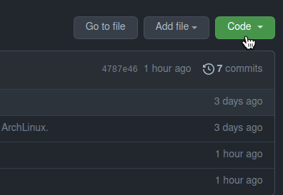

# sicoobnet-installer-script
Shell Script para instalação do **Sicoobnet Empresarial** no **Linux**

- [Introdução](#introduction)
- [Requisitos](#requirements)
- [Baixando o Script](#downloads)
- [Instalação](#install)
- [Desinstalar](#uninstall)

## Introdução

Inicialmente o intuito era somente de ajudar um amigo, mas no video que subi no youtube muitos demonstraram interesse, então resolvi refazer o `script` com a nova forma de rodar o **Sicoobnet Empresarial** espero que ajude. Para miores informações acesse o site oficial do [Sicoobnet Empresarial](https://empresarial.sicoobnet.com.br/instalador/).

É válido informar que o Script foi testado em somente 3 distribuições na qual tive acesso no momento em que fiz o script, foram elas, **Arch Linux**,  **Ubuntu 16.04 LTS** e **Linux Mint 20**, caso utilize em outra distro diferente das que foram mensionadas e funcione deixe um _Feedback_ para que outras pessoas saibam.

## Requisitos

Para que o programa rode precisaremos de algums programas adicionais:

- [OpenJDK]("https://openjdk.java.net/install") -- Instalação manual
- [Wine]("https://wiki.winehq.org/Download") -- O script tetará instalar

Considere instalar o `wine-mono` e o `wine-gecko`.

procure as informações de como instalar o `wine-mono` e `wine-gecko` em sua distribuição. Em alguns casos o wine já faz a instalação dos wine-mono e wine-gecko

## Baixando o Script

Para fazer o download do script é bem simples. Basicamente exite duas formas de fazer isso o primeiro exemple utilizaremos a linha de comandos para executar o comando `git clone` caso não tenha o **Git** instalado será necessário fazer a instalação.

Primeiro pressione _Ctrl + Alt + t_
para abrir um terminal ou navegue pelo menu de programas.

Caso utilize **Arch, Manjaro ou Antergos**  execute no terminal o comando:
> sudo pacman -S git

Caso Utilize **Ubuntu** ou **LinuxMint** execute o comando:
> sudo apt update && sudo apt install git -y

Caso não utilize nenhuma das distros acima pesquise como instalar o **Git** na que utiliza.

Caso já posssua é só seguir o passo a baixo.

### Clonando Repositório

Para fazer o clone do repositório basta copiar o comando abaixo.
> git clone https://github.com/devalvez/sicoobnet-installer-script.git

### Download ZIP
Para baixar o pacote .zip basta segui o exemplo da imagem abaixo.

## Instalação

Para fazer a instalação utilizando o Script é bem simples, primeiro iremos dar permisão de execução aos scripts `install.sh` e ao `run.sh` existentes no diretório que foi clonado ou extraido do zip.

Para dar a permissão de execução basta rodar o comando abaixo:
> sudo chmod +x install.sh run.sh
será solicitado que você informe a senha de super usuário para efetivar a ação.

O passo seguite é executar o script, para isso rode o seguinte comando:
> ./install.sh

No processo o `script` irá tentar identificar a distribuição que você está utilizando ou em qual ela se baseia. Caso consiga identificar, o `script` irá tentar fazer a instalação do **Wine**, **Wine-Gecko** e **Wine-Mono** mas caso ele não consiga você terá que faze-las manualmente como mencionado na sessão [Requisitos](#requirements).

Assim que o `script` encontre os programas necessários o download do instalador do **Sicoobnet** irá iniciar. Assim que o download estiver concluído, o `script` dará início a instalação. Despois de concluido, feche o programa para que o `script` crie o atalho na Área de Trabalho. É possível que sua senha seja solicitada para que o arquivo `run.sh` seja copiado e renomeado para _/usr/bin/sicoobnet.sh_

# Desinstalar
Para fazer a desistalação, em alguns casos você terá o gerenciador de desinstalação do **Wine** mas caso não tenha é bem simples também, basta ir no menu de janela e clicar em: _Exibir > Exibir Arquivos Ocultos_ ou pressionar _Ctrl + h_.

Em seguida navegue até o diretório _.wine/drive_c_ e deletar a pasta **Sicoobnet**

Depois pelo terminal executar o comando abaixo:

> sudo rm -rf /usr/bin/sicoobnet.sh

E para finalizar paga o atalho da Área de trabalho.

## Conclusão
Bem! Espero que tenha conseguido explicar de forma clara e se houver dúvidas em relação ao `Script` deixe um comentário na aba de discussão
